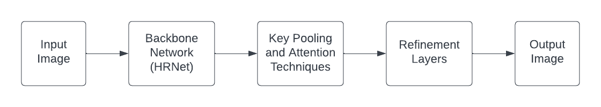
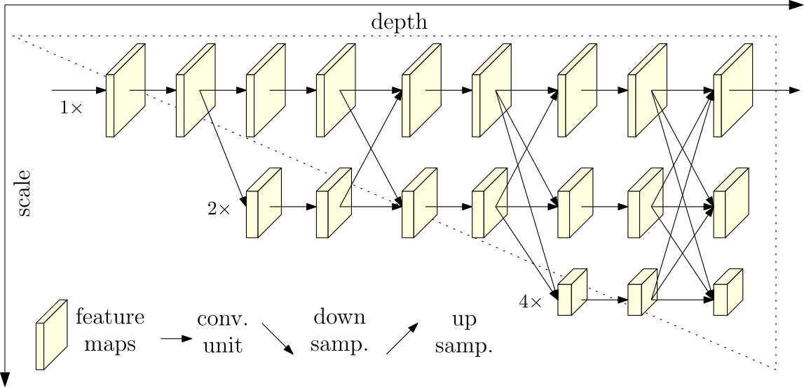

# Text Segmentation

This is a reproducibility study conducted on Paper [Rethinking Text Segmentation](https://arxiv.org/abs/2011.14021).

## Introduction
Text Refinment Net (TexRNet) is an innovative technique for text segmentation that accommodates the distinctive features of text such as non-convex boundaries and diverse texture. These features are often challenging for conventional segmentation models to handle. TexRNet enhances the outcomes obtained from standard segmentation approaches by utilizing key feature pooling and attention to modify inaccurately-activated text regions. Moreover, trimap and discriminator losses are introduced, that have resulted in substantial enhancements in text segmentation.

## Architecture



The above block diagram is a high level architecture of the model.
The Backbone CNN is a pretrained [HRNet](https://arxiv.org/abs/2002.06460), trained on ImageNet dataset.

The key pooling and attention layers are the novel part of the dataset, which does score corrections on the high-confidence ROIs. The refinment layer fuses the attention results with the output to backbone.

### HRNet Architecture


There are multiple phases in this CNN where results are downsampled and also there are feature maps of the same dimension (HxW) as the input image retained, and the results of downsampled feature maps are fused with the higher resolution maps.

## Running the project
Hardware requirement:
Nvidia GPU with CUDA drivers enabled

To see the hardware nvidia configurations type the below command in terminal:
```
nvidia-smi
```

### Setup the Environment
Create the virtual environment from terminal using conda package manager
```
conda create -n textseg python=3.7
conda activate textseg
pip install -r requirement.txt
```
### To do Ineference
Download the pretrained model from [Link](https://drive.google.com/file/d/1GQp1lf1-UbVYiESbMEw-XYQmTUQbXYl0/view?usp=sharing)

Place the image to be tested in the __test__ folder. 

run the command:
```
python inference.py --input test/filename.jpg --output test_output/filename_out.jpg
```

### To Test
Download Dataset from the [Link](https://drive.google.com/drive/folders/1bpjsgB_VmLh3igWBtdzLtyrdVqsWy4bj?usp=sharing). Unzip all the files and place the main folder in __data__ directory.

Download the pretrained model from [Link](https://drive.google.com/file/d/1GQp1lf1-UbVYiESbMEw-XYQmTUQbXYl0/view?usp=sharing). Drop it in the directory __pretrained__ .

```
python main.py --eval --pth pretrained/texrnet_hrnet.pth --hrnet --gpu 0  --dsname textseg
```

### To Train 
create directory with command: `mdkir pretrained/init` 

Download the pretrained model from [Link](https://drive.google.com/file/d/1hT9t13zWgrGEgmL0RE9AJfGIMX0dw_M8/view?usp=sharing).

```
python main.py --eval --pth pretrained/texrnet_hrnet.pth --hrnet --gpu 0 --dsname textseg
```